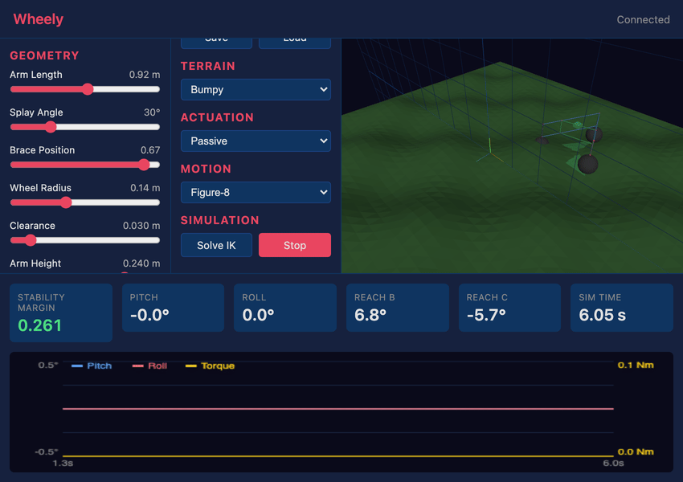

# Wheely

A kinematic simulation tool for a self-leveling tricycle robotic platform with parallelogram arm linkages. Designed as a power platform for uneven terrain (forestry, rough ground).



## The Platform

Three-wheel-drive with all wheels independently steered. Two parallelogram arms extend from an apex wheel to two rear wheels, with a cross brace connecting them. The parallelogram geometry keeps the cargo platform level as the arms conform to terrain.

```
         [Wheel A]  (apex)
            /\
           /  \
          /    \
  arm1   /      \   arm2
        /  brace \
       /====[]====\
      /            \
[Wheel B]      [Wheel C]
```

## Quick Start

```bash
pip install -e ".[dev]"
uvicorn wheely.server:app --port 8000
```

Open http://localhost:8000 in a browser.

## What You Can Do

- Adjust geometry parameters (arm length, splay angle, brace position, wheel radius) with real-time 3D feedback
- Switch between terrain presets (flat, slopes, bumpy, rough)
- Solve inverse kinematics to see how the platform adapts to terrain
- Run dynamic simulations with different actuation strategies (passive, active PID, spring-damper)
- Monitor stability margin and arm pivot angles

## Project Structure

```
wheely/           Python package
  geometry.py     Parametric platform geometry (PlatformConfig, wheel/brace positions)
  terrain.py      Terrain models (flat, slope, sinusoidal, composed)
  kinematics.py   Forward/inverse kinematics, stability analysis
  dynamics.py     Actuation strategies, time integration
  server.py       FastAPI backend with WebSocket simulation
web/              Three.js frontend (served via FastAPI)
tests/            pytest test suite
```

## Tests

```bash
pytest tests/ -v
```
